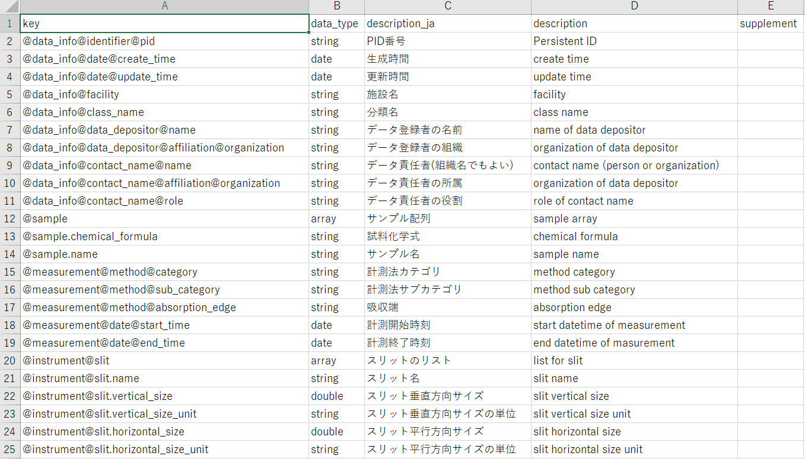

# metadata-schema


## 概要

メタデータ記述に関して [benten-meta](https://github.com/benten-tools/benten-meta)で例を示したが、メタデータ利用時はさらに以下も重要となる。

* メタデータ語彙定義を示すファイルの整備
* メタデータ記述が指定通り行われているかどうかの整合性確認

ここでは、これらを簡易に行うツールについて紹介する。


## Python環境構築

本ツールではPythonを利用する。[miniconda](https://docs.conda.io/en/latest/miniconda.html)を使ったケースでのPython環境構築例を以下に示す。

```
> conda create -n database python=3.8
> activate database
(database)> pip install -r requirements.txt
```


## メタデータ記述YAML、および語彙定義を示すCSVの例

* [./example/test/metadata.all.yml](./example/test/metadata.all.yml) の例

```
data_info:
  identifier:
    pid: spring8.xxxxx
  date:
    create_time: '2020-05-19 18:15:10'
    update_time: '2021-06-18 07:41:52'
  facility: SPring-8
  class_name: BL14B2
sample:
- chemical_formula: Ag-foil
  name: Silver
measurement:
  method:
    category: spectroscopy
    sub_category: XAFS
    absorption_edge: Ag K-edge
  date:
    start_time: '2016-04-12 00:54:00'
    end_time: '2016-04-12 00:59:00'
instrument:
  slit:
  - name: 4Dslit
    vertical_size: 1.0
    vertical_size_unit: mm
    horizontal_size: 5.0
    horizontal_size_unit: mm
```

* 上記に対応するメタデータ語彙定義CSV, [./example/test/metadata.schema.csv](./example/test/metadata.schema.csv) はエクセル経由で以下に示すように記述・閲覧できる。各コラムでkeyは メタデータ項目名(flat形式), data_type はデータ型 (string,date,double,int,array), descripton_jaは日本語での説明、descriptionは英語での説明、supplementは補足説明を示す。  



* 他の具体例は以下から参照できる。

|               | メタデータ記述 (YAML)                                        | メタデータ語彙 (CSV)                                         |
| ------------- | ------------------------------------------------------------ | ------------------------------------------------------------ |
| SPring-8 XAFS | [./example/sp8_xafs/metadata.all.yml](./example/sp8_xafs/metadata.all.yml) | [./example/sp8_xafs/metadata.schema.csv](./example/sp8_xafs/metadata.schema.csv) |
| 立命館SR XAFS | [./example/rksr_xafs/metadata.yml](./example/rksr_xafs/metadata.yml) | [./example/rksr_xafs/metadata.schema.csv](./example/rksr_xafs/metadata.schema.csv) |


## メタデータ語彙CSVからのjsonschema生成

* メタデータYAMLがメタデータ語彙CSVの定義通りに書かれているかどうかチェックするため、以下のように **gen_schema.py** スクリプトを用いてjsonschemaファイルを予め生成する。

```
> python gen_schema.py ./example/test/metadata.schema.csv
... input csv: ./example/test/metadata.schema.csv
... flag_null_allowed: None
... output ./schema/schema.json
```

* なお  各メタデータ項目について指定データ型のほか null データも許可する際には、以下のように "-n" オプションを付与する。

```
> python gen_schema.py ./example/rksr_xafs/metadata.schema.csv -n
... input csv: ./example/rksr_xafs/metadata.schema.csv
... flag_null_allowed: 1
... output ./schema/schema.json
```


## メタデータ記述の整合性確認

* config.yml に利用するスキーマファイルのパスを指定する (パスは URLでもよい)

```
schema_path: ./schema/schema.json
#schema_path: ./schema/schema.sp8_xafs.json
#schema_path: ./schema/schema.rksr_xafs.json
#schema_path: https://benten.spring8.or.jp/static/schema/benten-schema.json
```

* 以下に示すように **check_schema.py** スクリプトを用いてメタデータYAMLの整合性を確認する。

```
> python check_schema.py ./example/test/metadata.all.yml
... input metadata: ./example/test/metadata.all.yml
... schema path: ./schema/schema.json
... get schema from ./schema/schema.json
... check ./example/test/metadata.all.yml: OK
```

* もし、不整合がある際は、以下のようにエラーについて表示される。

```
>　python check_schema.py ./example/test/metadata.all.yml　 # 想定外の追加項目の場合
... input metadata: ./example/test/metadata.all.yml
... schema path: ./schema/schema.json
... get schema from ./schema/schema.json
... check ./example/test/metadata.all.yml: NG
 ==> benten_meta.Error()
     message = {
    "error": "Invalid metadata schema",
    "details": {
        "./example/test/metadata.all.yml": [
            "[data_info] Additional properties are not allowed ('test' was unexpected)"
        ]
    }
}
> python check_schema.py ./example/test/metadata.all.yml  # 異なるデータ型の場合
... input metadata: ./example/test/metadata.all.yml
... schema path: ./schema/schema.json
... get schema from ./schema/schema.json
... check ./example/test/metadata.all.yml: NG
 ==> benten_meta.Error()
     message = {
    "error": "Invalid metadata schema",
    "details": {
        "./example/test/metadata.all.yml": [
            "[instrument.slit.0.vertical_size] 'aaa' is not of type 'number'"
        ]
    }
}
```

* メタデータ記述の整合性確認は、Visual Studio Codeのプラグインを利用しても確認できる。以下の資料を参考のこと。
  * [Visual Studio Code利用におけるスキーマチェック設定](./README_vscode.md)
  
    

## データ引用

* SPring-8 BL14B2 XAFS database for Standard Sample,

  https://support.spring8.or.jp/xafs/standardDB_02/standardDB.html

* Ritsumeikan SR Center, "Ritsumeikan SR Center Soft X-Ray XAFS Database",
    http://www.ritsumei.ac.jp/acd/re/src/sx_xafs_db/ (2021).

  

## License

Apache License 2.0

## Author

Copyright (C) 2021 Takahiro Matsumoto (matumot@spring8.or.jp)

