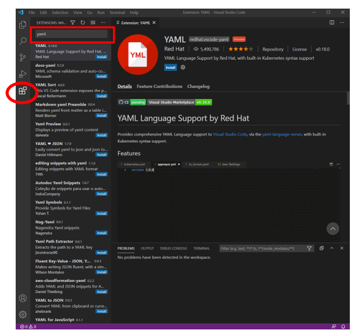
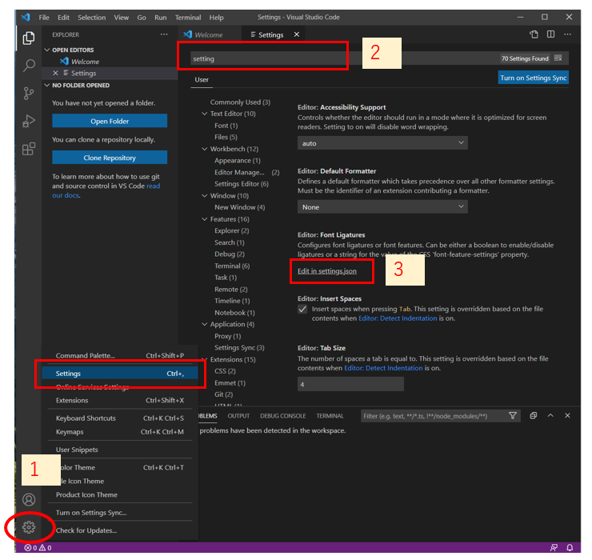
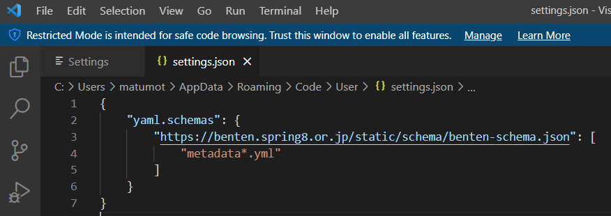
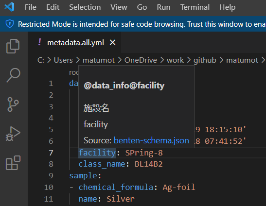
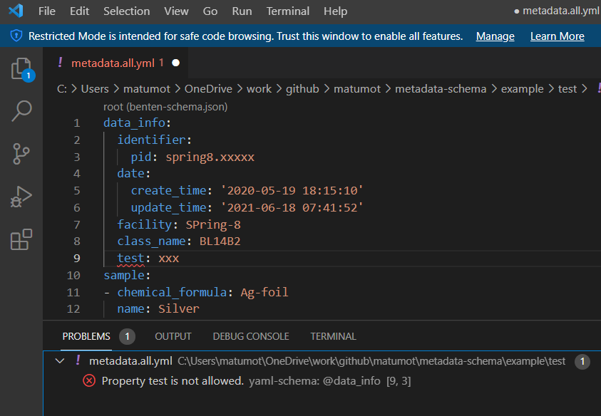

# Visual Studio Code利用におけるスキーマチェック設定


## 概要

BENTEN形式でのメタデータ記述 (yamlファイル)においては [Visual Studio Code](https://azure.microsoft.com/ja-jp/products/visual-studio-code/)を用いて編集することを推奨している。 Visual Studio Code利用を用いたメタデータフォーマットのスキーマチェックをするための設定について述べる。


## 事前準備

### redhat.vscode-yamlのインストール

* Visual Studio Codeを起動し、左下の Extensionsをクリックし、左上の検索窓で yaml を入力し、検索する。そこで現れた YAML redhat.vscode-yaml をインストールする。



###　settings.jsonの編集

* まず、左下の1で Settingsを選択する。
* 2の上部の検索窓で settings と入力する。
* その結果表示される 3 の Edit in settings.json をクリックする。



* settings.json では以下のようにyaml.schemasの設定を入力する。

```
{
    "yaml.schemas": {
        "https://benten.spring8.or.jp/static/schema/benten-schema.json": [
            "metadata*.yml"
        ]
    }
}
```




## スキーマチェックの利用例

* メタデータ語彙の上にカーソルを移動させると説明が表示される。




* メタデータに整合性が取れていない場合にはエラーメッセージが表示される。




